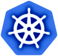
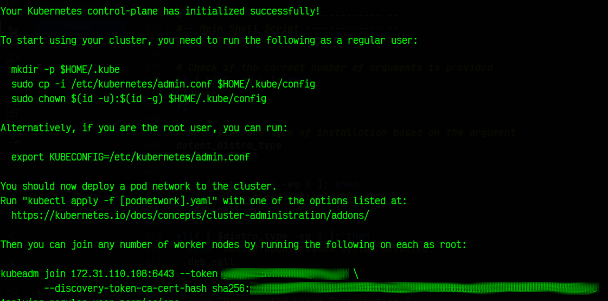

# k8s-vanilla-cluster

----------------------



Kubernetes Vanilla Cluster using `kubeadm`

## Purpose

This is a K8s lightweight automation Project to build and automate Kubernetes cluster with a control plane and worker nodes. It supports both RHEL-based and Debian/Ubuntu-based Linux distributions. The script simplifies the process of setting up a Kubernetes cluster for local or small-scale environments, providing a straightforward way to get started with Kubernetes deployment.

## Context: K8s Vanilla x Cloud Providers

While this script provides a Kubernetes setup, there are some notable differences compared to managed Kubernetes services like AWS EKS, Google GKE, or Azure AKS:

| Feature               | Vanilla Kubernetes                                | Cloud Provider Kubernetes                            |
|------------------------|--------------------------------------------------|-----------------------------------------------------|
| Infrastructure         | Your responsibility                              | Cloud provider's responsibility                     |
| Tooling                | Custom/community tools                           | Provider-specific tools                             |
| Support                | Self-reliance / Community                        | Provider support                                    |
| Scalability            | Manual provisioning                              | Automated scaling                                   |
| Cost                   | Hardware costs only                              | Kubernetes service + resources                      |
| Maintenance            | Full responsibility                              | Managed by the provider                             |
| Complexity             | High                                              | Lower (depending on the service)                     |
| Flexibility            | High                                              | Moderate (constrained by provider)                   |

## About this Project

The script `k8s-install.sh` is designed to install and configure Kubernetes on individual nodes in the cluster, including the setup of the networking layer, such as Calico or Flannel, for pod-to-pod communication:

- **Control Plane Node**: The central management node that hosts the Kubernetes API server, scheduler, and controller manager.
- **Worker Nodes**: Nodes that run the applications and workloads managed by the Kubernetes cluster.

### Recommendation

The recommended number of Virtual Machines (VMs) for a high-availability (HA) Vanilla Kubernetes Cluster typically depends on the size and criticality of your deployment, but general best practices suggest the following:  

- **Control plane**: 3-5 VMs.
- **Worker node**: 2 or more VMs, depending on workload.

This environment is ideal for **lab**, **development**, or **home infrastructure** use, not for production in critical environments without further hardening.

## How The Script Works

1. **System Prerequisites**:
   - The script checks for and configures necessary system parameters, including disabling swap, loading kernel modules, and configuring network settings.
   - Installs required Kubernetes packages (`kubelet`, `kubeadm`, and `kubectl`), Docker or containerd as the container runtime, and Docker Compose for container management.

2. **Control Plane Setup**:
   - When run on the control plane node, the script initializes the Kubernetes control plane using `kubeadm`. This involves setting up the API server, controller manager, and scheduler.
   - After initializing the control plane, it configures user permissions for accessing Kubernetes and prepares the network plugin (Calico/Flannel).

3. **Worker Node Setup**:
   - When run on worker nodes, the script joins the node to the Kubernetes cluster by using the token and hash provided by the control plane installation process.
   - It configures the necessary container runtime and Kubernetes components for the worker node to function properly within the cluster.

4. **Networking Setup**:
   - The script installs a network plugin (Calico by default) to enable pod-to-pod communication across the cluster.
   - It ensures that the network configuration is compatible with the pod network CIDR and the control plane's API server.

5. **Container Runtime**:
   - The script supports both Docker and containerd as container runtimes, depending on the user's preference. It installs and configures these runtimes on the nodes.

6. **Compatibility**:
   - The script is compatible with both RHEL-based and Debian/Ubuntu-based systems, automatically detecting the distribution and performing the appropriate installation steps.

### Summary

The script sets up a **self-hosted, Kubernetes "Vanilla" Cluster** using:

- `kubeadm` for bootstrapping
- `containerd` as the default container runtime
- **Calico** or **Flannel** as the CNI (Container Network Interface) plugin
- Optional installation of `docker` and `docker-compose`

## Inputs Required by the Script

The `k8s-install.sh` script requires several inputs during execution to configure the Kubernetes cluster. Below is a detailed explanation of each input:

### Control Plane Inputs

When setting up the control plane, the following inputs are required:

1. **Interface Name**:
   - **Prompt**: `Enter the Interface Name (i.e.: eth0):`
   - **Description**: The network interface to be used for Kubernetes communication. For example, `eth0` or `wlan0`.
   - **Validation**: The script checks if the provided interface exists on the system.

2. **POD CIDR**:
   - **Prompt**: `Enter the PODs CIDR (Default: 10.10.0.0/16):`
   - **Description**: The CIDR range for pod networking. If no input is provided, the default value (`10.10.0.0/16`) is used.

3. **Network Plugin Version**:
   - **Prompt**:
     - For Calico: `Enter Calico release version (Default: v3.30.0):`
     - For Flannel: `Enter Flannel release version (Default: v0.26.7):`
   - **Description**: The version of the network plugin (Calico or Flannel) to be installed. If no input is provided, the default version is used.

4. **Optional Docker Installation**:
   - **Prompt**: `Do you want to install Docker? (y/n):`
   - **Description**: Allows the user to choose whether to install Docker on the node.

5. **Optional Docker Compose Installation**:
   - **Prompt**: `Do you want to install Docker Compose? (y/n):`
   - **Description**: Allows the user to choose whether to install Docker Compose on the node.

### Worker Node Inputs

When setting up a worker node, the following inputs are required:

1. **Port**:
   - **Prompt**: `Enter the PORT (Default: 6443):`
   - **Description**: The port used to communicate with the control plane. If no input is provided, the default value (`6443`) is used.

2. **Control Plane IP Address**:
   - **Prompt**: `Enter the Control Plane IP Address:`
   - **Description**: The IP address of the control plane node. The script validates the format and checks if the IP is reachable.

3. **Control Plane Token**:
   - **Prompt**: `Enter the Control-Plane TOKEN:`
   - **Description**: The token generated during the control plane setup, used to join the worker node to the cluster.
   - **Validation**: The token cannot be empty.

4. **Control Plane Hash**:
   - **Prompt**: `Enter the Control-Plane HASH:`
   - **Description**: The hash of the control plane certificate, used for secure communication between the worker node and the control plane.
   - **Validation**: The hash cannot be empty.

### Example User Interaction

#### Control Plane Setup

```shell
Enter the Interface Name (i.e.: eth0): eth0
Using interface: eth0
Enter the PODs CIDR (Default: 10.10.0.0/16): 
Using default POD CIDR: 10.10.0.0/16
Choose a network plugin to install:
1) Calico
2) Flannel
Enter your choice (1 or 2): 1
Enter Calico release version (Default: v3.30.0): 
Using default Calico version: v3.30.0
Do you want to install Docker? (y/n): y
Installing Docker...
Do you want to install Docker Compose? (y/n): n
Docker Compose installation skipped.
```

## How to Use

Clone this repository, access the repo folder:

```shell
git clone https://github.com/alexolinux/k8s-vanilla-cluster.git
cd k8s-vanilla-cluster
```

Run the script `k8s-install.sh` it with the argument `control-plane` to set up the control plane or `node` to set up a worker node:

```shell
./k8s-install.sh control-plane
./k8s-install.sh node
```

### Control-Plane info

After installing control-plane, the output will provide you the **Token/Hash** required by Workers:



### Prevent workloads from running on the control-plane node

To keep application pods off the control-plane node:

```shell
kubectl taint nodes $(hostname) node-role.kubernetes.io/control-plane=:NoSchedule
```

## Suggested Articles

- <https://kubernetes.io/docs/concepts/architecture/>
- <https://kubernetes.io/docs/setup/production-environment/tools/kubeadm/install-kubeadm/>
- <https://linuxconfig.org/how-to-create-a-kubernetes-cluster>
- <https://www.digitalocean.com/resources/articles/unmanaged-vs-managed-kubernetes>

## References

- [Kubernetes Official Docs](https://kubernetes.io/docs/home/)
- [Calico CNI Plugin](https://docs.tigera.io/calico/latest/getting-started/kubernetes/self-managed-onprem/onpremises)
- [Flannel CNI Plugin](https://github.com/flannel-io/flannel)
- [Docker](https://docs.docker.com/engine/install/)
- [docker-compose](https://docs.docker.com/compose/)

## Author: Alex Mendes

<https://www.linkedin.com/in/mendesalex>
